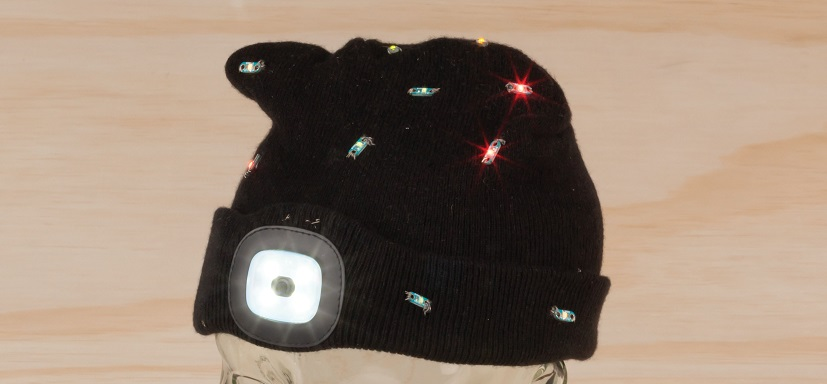

# Star Spangled Beanie
 Put some LEDs in your BEANIE

With some of our wearable devices; the wearable LEDs and ESP32 Wearable we've made a flashing Beanie. WiFi and Bluetooth compatibility means you can control it with your phone, and for an extra bit of interest, we've patched the wires into the battery compartment on the beanie, so it is all powered by a 3.7V USB-rechargable lithium battery that you can still use as a head torch if needed.

## Bill of Materials

| Qty | Code                                     | Description            |
| --- | ---------------------------------------- | ---------------------- |
| 1   | [ST3214](https://jaycar.com.au/p/ST3214) | Beanie                 |
| 1   | [KM1058](https://jaycar.com.au/p/KM1058) | Power pad slide switch |
| 1   | [XC3810](https://jaycar.com.au/p/XC3810) | Wearable ESP32 board   |
| 1   | [PT4452](https://jaycar.com.au/p/PT4452) | 2 Pin JST connector    |
| 1   | [KM1036](https://jaycar.com.au/p/KM1036) | Wearable Green LED     |
| 1   | [KM1038](https://jaycar.com.au/p/KM1038) | Wearable Red LED       |
| 1   | [WW4100](https://jaycar.com.au/p/WW4100) | Conductive steel wire  |

You will also need to get needles and sewing utensils if you don't have any around, A quick and easy solution is to also use the [KM1080](https://jaycar.com.au/p/KM1080).

## Bluetooth connectivity

We use bluetooth in this ESP32 program that can be controlled with any `SerialBluetooth` compatible app. On android, we used the _Bluetooth Switches_ app by `yashx`. This provides us with a series of buttons that we can use to turn on and off the LED arrays.

For instructions on how to build this, check out https://jaycar.com.au/star-spangled-beanie/
